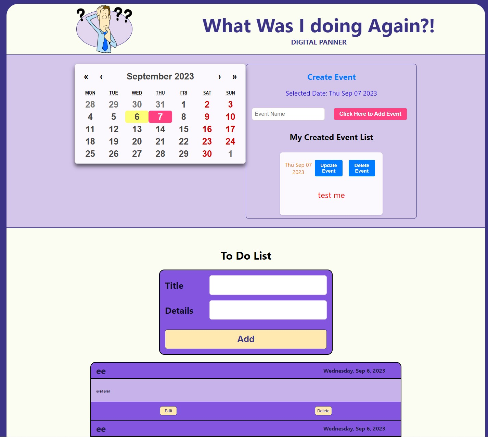

# What Was I doing Again?!

A digital planner to help you remember things.

## Environment Variables

To run this project, you will need to add the following environment variables to your .env file

`MONGO_URI`

`SECRET`

## Features

- todo List
- Interactive Calendar
- Save notes to the calendar each day

## Trello Board

## Relationship Diagram

## Wireframe Layout

## Technologies Used

- ReactJs
- Javascript
- NodeJs
- ExpressJs
- MongoDb
- React Calendar
- Dotenv
- Bcrypt
- Json web tokens
- HTML
- CSS

## Future Enhancements

- Add Shoping List
- Add User Groups
- Add Admin Panel
- Add Chat (between family members most likely)
- Add message board (same as above)